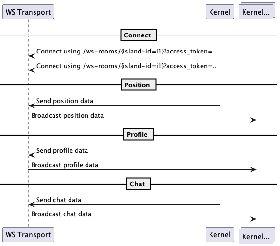

# Table of Contents

1.  [Overview](#orgb4e7580)
2.  [Handshake](#org6e5c509)
3.  [Global messages: message bus](#orgb951a93)
4.  [LiveKit Transport](#org2025567)
5.  [WS Transport](#orge29f5ae)
6.  [Peer-to-peer](#orgb5e0f03)
7.  [Next steps: Scale with multiple nodes](#orgc9aa269)
    1.  [Scene messages](#orgc13dab8)
    2.  [LiveKit](#org5fcae9b)
    3.  [WS](#org356245e)
8.  [NATS Messages](#orgc1b2379)

# Overview

The idea of the [new version of comms](https://github.com/decentraland/adr/blob/main/docs/ADR-70-new-comms.md) is to leverage the concept of an island as a unit, and be able to define specific settings per island. By doing so, we have the flexibility to deploy high-performant services when needed, while providing alternatives for extensibility or resource-optimization. We call each alternative a **transport**.

Initially, three types of transports will be supported:

-   [LiveKit](https://github.com/decentraland/comms3-livekit-transport): webRTC, high-quality, low latency, needs extra infrastructure to scale.
-   [WebSocket](https://github.com/decentraland/ws-room-service): simple to implement and extend, higher latency than webRTC alternatives, needs extra infrastructure to scale.
-   [Peer-to-peer](https://github.com/decentraland/explorer-bff): webRTC, no extra infrastructure needed to scale, latency increases as more peers are added to an island.

With regards to DCL platform alone (that is, without third-party servers), users mostly need to receive information from peers on the same island, so the transports will be in charge of broadcasting information between peers on a given island. For global messages (for example:, scene messages), the [Backend-for-Frontend](https://github.com/decentraland/explorer-bff) (BFF) is going to be used (See https://github.com/decentraland/sdk/issues/180 and [ADR-70: New comms](https://github.com/decentraland/adr/blob/main/docs/ADR-70-new-comms.md) for more information).

# Handshake

-   The BFF acts as the entry point to the Comms services. Users authenticate against this service using their addresses.
-   [Archipelago](https://github.com/decentraland/archipelago-service) receives (thought the BFF) a heartbeat with the current peer position and sends `island_changed` messages. This message will notify the kernel that the user has to join or change to a specific island, the message will contain a connection string that the kernel will use to connect to one of the transports defined above. This way Archipelago is in charge of telling the kernel which transport will be used.
-   The BFF and Archipelago are connected as part of a [NATS](https://nats.io/) cluster, sending and receiving peer events.

# Global messages: message bus

The BFF is in charge of managing global messages (that is, messages across an island, for example, scene messages), in the future, this could be moved to its own project as this is not part of the transport's duties.

# LiveKit Transport

[LiveKit](https://livekit.io/) is a high-quality media server using webRTC, very efficient and very easy to deploy. LiveKit has tools for webRTC signaling, the concepts of rooms (which will be adopted as islands), and its own authentication. It also has its own [TURN server](https://webrtc.org/getting-started/turn-server), so each LiveKit deployment will have a nearby TURN server and this optimizes the relay messages process.

# WebSocket Transport

A simple WebSocket that classifies peers into rooms (islands) and broadcast messages inside the room. It uses JWT authentication with a shared secret (generated in Archipelago).

# Peer-to-peer

The BFF manges the signaling between peers to stablish the webRTC connection. 

# Next steps: Scale with multiple nodes

Archipelago should be able to register transport nodes and be able to balance islands not only in the available transports but also according to a set of owner-defined rules, in order to, for example, use LiveKit for an island in a very crowded place and p2p in a place with very few peers.

Owners may want to connect third-party servers to their scenes, such as game servers or state servers. Those servers may want to receive or publish information to/from users on a given island or globally to all the people in a scene.

The current idea is to connect BFF (for messages across scenes) and transports to the NATS cluster, and then expose a service that will sit between NATS and third-party service to be able to subscribe and publish messages to the cluster.

## Scene messages

## LiveKit

## WS

# NATS Messages

-   `client-proto.peer.<peer_id>.hearbeat` (data defined in archipelago.proto/HeartbeatMessage)
-   `peer.<peer_id>.connect` (no data)
-   `peer.<peer_id>.disconnect` (no data)
-   `client-proto.peer.<peer_id>.island_changed` (data defined in archipelago.proto/IslandChangedMessage)
-   `client-proto.island.<island_id>.peer_left` (data defined in archipelago.proto/LeftIslandMessage)
-   `client-proto.island.<island_id>.peer_join` (data defined in archipelago.proto/JoinIslandMessage)
-   `client.peer.<peer_id>....` message from peer, application data
-   `service.discovery` serverName and custom status depending on the service